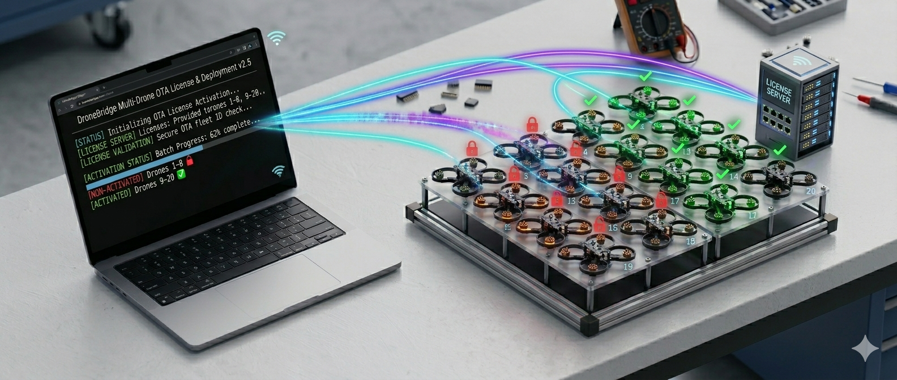

# Support Suite

<figure><figcaption></figcaption></figure>

The **DLSE Commercial Support Suite** is an open-source Python library and set of ready-to-use scripts that automate the most time-consuming parts of managing a large fleet of ESP32s. Instead of configuring, flashing, and licensing each drone one by one, you set up one reference device, export its configuration, and let the suite handle the rest.

<a href="https://github.com/DroneBridge/DLSECommercialSupportSuite" class="button primary" data-icon="github">View on GitHub</a>

***

## What It Can Do

<table data-full-width="false"><thead><tr><th>Capability</th><th>How</th><th>Use When</th></tr></thead><tbody><tr><td><strong>Batch serial flash + configure + activate</strong></td><td><code>batch_install_dlse_allinone.py</code></td><td>Initial setup of a new fleet — plug in ESP32s one by one</td></tr><tr><td><strong>Batch OTA firmware update</strong></td><td><code>batch_ota_update_allinone.py</code></td><td>Upgrading all drones in the field over Wi-Fi</td></tr><tr><td><strong>Batch OTA license activation</strong></td><td><code>batch_ota_license_activation.py</code></td><td>Licensing a fleet of ESP32s over Wi-Fi in one pass</td></tr><tr><td>Scan network for DLSE devices</td><td>Library function</td><td>Discovery, health checks</td></tr><tr><td>Upload / download licenses</td><td>Library function</td><td>Re-licensing, backup</td></tr><tr><td>Get activation key from device</td><td>Library function</td><td>Programmatic licensing workflows</td></tr><tr><td>Remote reset of ESP32</td><td>Library function</td><td>Automated test pipelines</td></tr><tr><td>Change settings over Wi-Fi</td><td>Library function</td><td>Dynamic reconfiguration without USB</td></tr><tr><td>Download flight logs via the ESP32 bridge</td><td>Library function</td><td>Post-show data collection</td></tr></tbody></table>

***

## Prerequisites

* Python 3.10 or higher
* A DroneBridge account and **secret token** (obtained from [drone-bridge.com/dlse](https://drone-bridge.com/dlse) dashboard) for licensing features
* The [latest DLSE release binaries](https://drone-bridge.com/dlse/) downloaded and extracted locally

***

## Installation

```bash
git clone --recursive https://github.com/DroneBridge/DLSECommercialSupportSuite.git
cd DLSECommercialSupportSuite
pip install .
```

Each script contains configuration variables near the top (such as `MY_SECRET_TOKEN`, `ESP_SERIAL_PORT`, or subnet addresses). Open the script you intend to use and update these before running.

***

## Batch Serial Flash, Configure & Activate

### Overview

`batch_install_dlse_allinone.py` is the main script for setting up a fresh fleet. You run it once, then plug in your ESP32 modules one by one via USB. For each device it automatically:

1. Flashes the DLSE firmware over the serial connection
2. Writes your exported configuration (SSID, IPs, GPIO pins, MAVLink settings, etc.)
3. Assigns a unique hostname, AP SSID, and static IP based on a sequential index (e.g., drone 55, 56, 57…)
4. Requests a license from the DroneBridge license server and activates the device
5. Logs everything to a `/logs` folder


**Re-flashing an already-licensed device?** The script detects that the ESP32 already has a valid license, pulls it from the device before flashing, and re-applies it after. You will not lose license credits by re-running the script on the same hardware.


### Workflow



#### Configure one reference ESP32

Set up a single ESP32 exactly as you want all drones in your fleet to be configured.

1. Flash DLSE using the [online flasher](https://drone-bridge.com/flasher/)
2. Connect to the ESP32's Wi-Fi AP (`DroneBridge for ESP32`, password `dronebridge`)
3. Open the web interface at `http://192.168.2.1` and configure all settings (UART pins, baud rate, Wi-Fi credentials, power management, etc.)
4. Test the configuration with your show drone and flight controller
5. Activate this reference device manually using your token from [drone-bridge.com](https://drone-bridge.com) and the online [license generator](https://drone-bridge.com/licensegenerator/)
6. **Export the settings** using the web interface — this produces a `.csv` file you will pass to the batch script



#### Prepare the suite

Download the latest DLSE release binaries from [drone-bridge.com/dlse](https://drone-bridge.com/dlse/) and extract them **into the `DLSECommercialSupportSuite` folder**. The folder name (e.g., `DroneBridge_ESP32DLSE_BETA3`) is used as the `--release-folder` argument.



#### Run the batch script

```bash
python batch_install_dlse_allinone.py \
  --token <YOUR_SECRET_TOKEN> \
  --release-folder "DroneBridge_ESP32DLSE_BETA3" \
  --settings-file my_parameters/dlse_my_params.csv \
  --start-index 55
```

**Arguments:**

| Argument           | Description                                                                             |
| ------------------ | --------------------------------------------------------------------------------------- |
| `--token`          | Your secret token from the drone-bridge.com dashboard                                   |
| `--release-folder` | Folder containing the DLSE firmware binaries                                            |
| `--settings-file`  | The `.csv` settings file exported from your reference ESP32                             |
| `--start-index`    | Starting index for per-drone unique values (AP SSID suffix, hostname, static IP suffix) |

The `--start-index` parameter allows automatic per-device differentiation. With `--start-index 55`, the first ESP32 you plug in will get a hostname of `<your_hostname>55`, an AP SSID of `<your_ssid>55`, and a static IP suffix of `55`. The index increments automatically for each subsequent device.



#### Plug in ESP32s one by one

With the script running, simply connect your ESP32 modules to the computer via USB one at a time. The script detects each new device, flashes it, configures it, and activates it — then waits for the next one. The whole process per device takes under a minute.

All actions are logged to the `/logs` folder for your records.




**Offline activation is also supported.** If the license server is unavailable, the script checks the `/received_licenses` folder for a previously downloaded license file matching the device's activation key, and applies it locally.


***

## Batch OTA Firmware Update

### Overview

`batch_ota_update_allinone.py` scans your Wi-Fi subnet, discovers all DLSE devices, and pushes a new firmware version to each of them over Wi-Fi. No USB cable or physical access needed. **Existing settings and licenses are preserved** across an OTA update.


**Skybrush Live must be shut down** before running this script. The script needs to bind to the broadcast port that Skybrush Live also uses for device discovery.


### Usage

Update all detected devices:

```bash
python batch_ota_update_allinone.py \
  --release-folder "DroneBridge_ESP32DLSE_BETA4" \
  --subnetmask "192.168.1.0/24"
```

Update only devices running a specific version (useful when your fleet has mixed versions):

```bash
python batch_ota_update_allinone.py \
  --release-folder "DroneBridge_ESP32DLSE_BETA4" \
  --subnetmask "192.168.1.0/24" \
  --target-version "1.0.0-beta.3"
```

**Arguments:**

| Argument           | Description                                                                                           |
| ------------------ | ----------------------------------------------------------------------------------------------------- |
| `--release-folder` | Path to the folder with DLSE firmware binaries                                                        |
| `--subnetmask`     | IP range to scan, e.g. `192.168.1.0/24`                                                               |
| `--target-version` | _(Optional)_ Only update ESP32s running this specific version. Devices on other versions are skipped. |

### What Happens

The script scans the subnet, lists all discovered DLSE devices with their current firmware versions, and asks for confirmation before proceeding. It then pushes the firmware binary matching each device's chip type (C3, C5, or C6) and reports success or failure per device.

<details>

<summary>Example console output</summary>

```
[2026-03-04 23:15:34] Found binaries for ESP32C3, ESP32C5, ESP32C6
[2026-03-04 23:15:37] Found 2 ESP32 (DLSE) device(s).
    [ ] IP 192.168.1.174  SYS_ID: 174  firmware: 1.0.0-beta.4
    [X] IP 192.168.1.206  SYS_ID: 206  firmware: 0.0.0-dev.1

Do you want to proceed with the OTA update for the selected [x] devices? (y/n): y

Skipping 192.168.1.174 — not running target version
Updating 192.168.1.206 ...
Uploading: 100%|██████████| 1.11M/1.11M [00:14<00:00]
✅ OTA update successful — rebooting device

OTA update finished. 1 updated successfully. 0 failed.
```

</details>

***

## Batch OTA License Activation

### Overview

`batch_ota_license_activation.py` continuously scans the subnet and activates any unlicensed DLSE device it finds — over Wi-Fi, without needing a USB connection. Run it while your drones are powered on and connected to the show network, and it will work through the fleet automatically.


**Skybrush Live must be shut down** before running this script.


### Usage

```bash
python batch_ota_license_activation.py \
  --token <YOUR_SECRET_TOKEN> \
  --subnetmask "192.168.1.0/24" \
  --esp32localbrcstport 14635 \
  --esp32remotebrcstport 14630
```

**Arguments:**

| Argument                 | Description                                                |
| ------------------------ | ---------------------------------------------------------- |
| `--token`                | Your secret token from the drone-bridge.com dashboard      |
| `--subnetmask`           | IP range to scan                                           |
| `--esp32localbrcstport`  | Must match `udp_local_port` in each ESP32's configuration  |
| `--esp32remotebrcstport` | Must match `wifi_brcst_port` in each ESP32's configuration |

The script scans on a loop. As drones are powered on and appear on the network, they are discovered, their activation key is read, a license is requested from the DroneBridge license server, and the license is installed on the device. All licenses are also saved locally to `/received_licenses` as a backup.

<details>

<summary>Example console output</summary>

```
[23:34:08] Scanning 192.168.1.0/24 for ESP32 devices...
[23:34:10]   Found 0 devices.
[23:34:28] Scanning 192.168.1.0/24 for ESP32 devices...
[23:34:30]   Found 1 device.
[23:34:31] Requesting license from drone-bridge.com...
[23:34:31] ✅ License generated and saved.
[23:34:31] ✅ License signature valid.
[23:34:32] 🔑 Activated 192.168.1.149
[23:34:42] Session total: 1 device activated.
```

</details>

***

## Library Functions & Individual Examples

Beyond the batch scripts, the suite exposes a Python library (`DroneBridgeCommercialSupportSuite.py`) for building your own automation tools. Individual example scripts are provided for each function:

| Script                                 | What It Demonstrates                                      |
| -------------------------------------- | --------------------------------------------------------- |
| `example_esp32_get_license.py`         | Request a license file using an activation key            |
| `example_params_update_flash.py`       | Update configuration parameters in the CSV and flash them |
| `example_esp32_ota_update.py`          | OTA firmware update for all detected devices              |
| `example_esp32_download_log.py`        | Download flight controller logs via the ESP32 bridge      |
| `example_esp32_download_log_MAVSDK.py` | Same, using MAVSDK                                        |

***

## OpenAPI Definition

The suite also ships with an **OpenAPI definition** (`api_definition/openapi_definition.yaml`) describing the full DLSE REST API. Use it to generate client code in any language, explore the API in tools like Swagger UI, or build your own tooling on top of the DLSE configuration endpoint.

See the [Developers — DLSE API Definition](developers-dlse-api-definition/) section for more.
