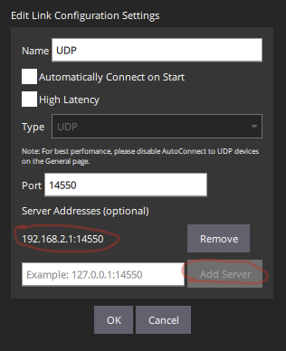
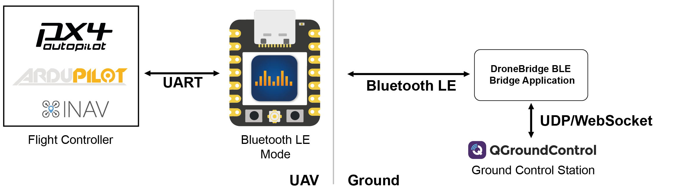
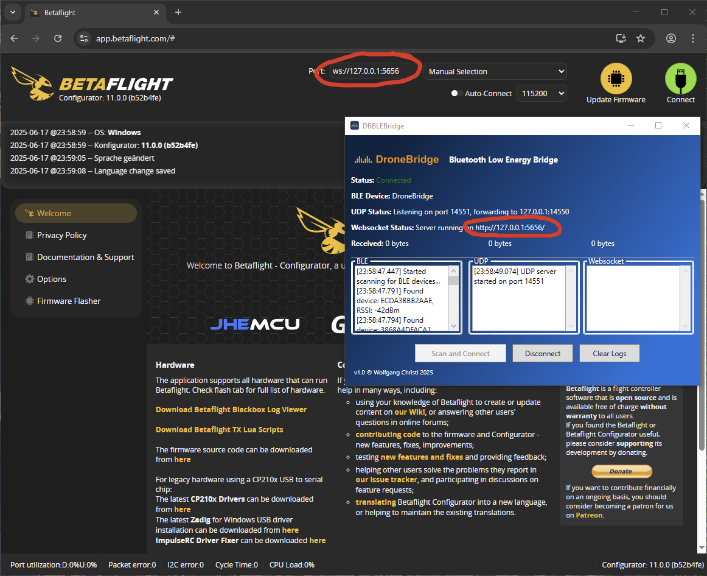
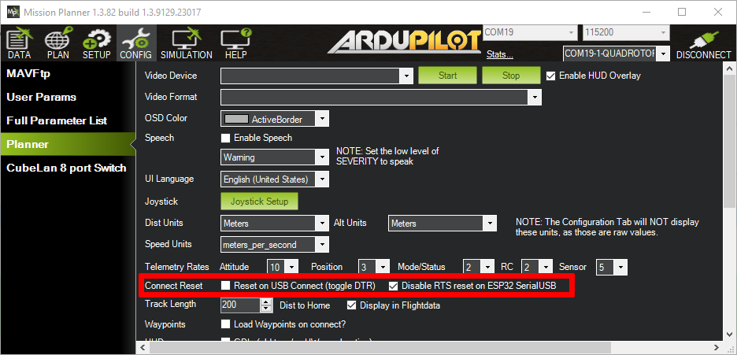

# Configuration

## Web Interface

1. Connect to the wifi `DroneBridge for ESP32` with password `dronebridge`
2. In your browser, type: `dronebridge.local` (Chrome: `http://dronebridge.local`) or `192.168.2.1` into the address bar. **You might need to disable the cellular connection to force the browser to use the WiFi connection**
3. Configure as you please and hit `save & reboot`

<figure><figcaption></figcaption></figure>

## UART Parameters&#x20;

For the Official DroneBridge for ESP32 Board HW v1.0, HW v1.1 & HW v1.2.\
This configuration is only valid for the official boards! If you did not connect the flow control lines, set RTS and CTS pins to 0 to disable flow control. Check the [Flow Control section](hardware-and-wiring.md#uart-flow-control) for more details.

<table><thead><tr><th width="247">Board</th><th width="100" data-type="number">TX GPIO</th><th width="100" data-type="number">RX GPIO</th><th width="100" data-type="number">RTS GPIO</th><th width="89" data-type="number">CTS GPIO</th></tr></thead><tbody><tr><td><strong>ESP32C3</strong> Official Hardware</td><td>5</td><td>4</td><td>6</td><td>7</td></tr><tr><td><strong>ESP32C6</strong> Official Hardware</td><td>21</td><td>2</td><td>22</td><td>23</td></tr></tbody></table>

## DroneBridge for ESP32 Modes

DroneBridge for ESP32 supports the following modes:

<table data-full-width="true"><thead><tr><th width="124">SYS_ESP32_MODE</th><th>DroneBridge for ESP32 Mode</th><th width="91">Encryption</th><th>Description</th><th>Notes</th></tr></thead><tbody><tr><td>1</td><td>WiFi Access Point Mode</td><td>WPA2 PSK</td><td>ESP32 launches classic WiFi access point using 802.11b rates</td><td>Any WiFi device can connect. Can manage up to 10 WiFi stations/clients.</td></tr><tr><td>2</td><td>WiFi Client Mode</td><td>min. WEP</td><td>ESP32 connects to an existing WiFi access point. LR Mode supported</td><td>Encryption defined by access point. Multiple drones can connect to one AP and GCS. 802.11b rates</td></tr><tr><td>3</td><td>WiFi Access Point Mode LR</td><td>WPA2 PSK</td><td>ESP32 launches WiFi access point mode using espressifs LR mode</td><td>Only ESP32 LR Mode enabled devices can detect and connect to the access point. Data rate is reduced to 0.25Mbit. Range is greatly increased.</td></tr><tr><td>4</td><td>ESP-NOW LR Mode AIR</td><td>AES256-GCM</td><td>ESP32 is able to receive ESP-NOW broadcast packets from any GCS in the area and forwards them to the UART. Broadcasts to all GND stations in the area.</td><td>Connectionless protocol. Data reate is reduced to 0.25Mbit. Range is greatly increased compared to WiFi modes. Custom encryption mode for ESP-NOW broadcasts and protocol.</td></tr><tr><td>5</td><td>ESP-NOW LR Mode GND</td><td>AES256-GCM</td><td>ESP32 is able to receive ESP-NOW broadcast packets from any drone in the area and forwards them to the UART. Broadcasts to all AIR stations in the area.</td><td>Connectionless protocol. Data rate is reduced to 0.25Mbit. Range greatly increased compared to WiFi modes. Custom encrpytion mode for ESP-NOW broadcasts and protocol.</td></tr><tr><td>6</td><td>Bluetooth LE</td><td>TBD</td><td>Bluetooth LE (BLE) connection to your device.  </td><td>
The application (GCS) must explicitly support BLE connections. So far this is not the case. They only support Bluetooth Classic SPP which is NOT BLE.

Use the DroneBridge BLE Bridge application to connect to your GCS.
</td></tr></tbody></table>

### WiFi Access Point Mode

<figure><figcaption>
DroneBridge for ESP32 Wifi Access Point DroneBridge for ESP32 Wifi Client Mode ConceptMode Concept
</figcaption></figure>

ESP32 will create a Wi-Fi Access Point to which other ground control stations (GCS) can connect. UDP and TCP connections are accepted. All traffic is secured using WPA2-PSK.

#### **Configuration**

A single ESP32 is used and connected via the UART serial interface to the flight controller.

* Set the Mode to `WiFi Access Point Mode` and define an SSID and password for the access point.
* Define the correct pins (for official boards see above) and baud rate for the UART serial interface to the flight controller.
* Set the desired protocol and packet size.

Save the settings and restart the ESP32. After that, you are able to connect to the access point using WiFi. Once connected open the GCS and connect via UDP or TCP to the ESP32s IP address (default is 192.168.2.1 if not defined otherwise in the web interface)

### WiFi Client Mode

ESP32 will try to connect to the specified WiFi Access Point.

You can specify the access point's SSID and password in the web interface using the respective fields. The access point must support at least WEP encryption.

<figure><figcaption>
DroneBridge for ESP32 Wifi Client Mode Concept
</figcaption></figure>

**In case of a UDP connection**, the ground station must send at least one packet (e.g. MAVLink heartbeat etc.) to the UDP port of the ESP32 to register as an endpoint. The ESP32 will then broadcast UDP messages to that packet's origin (port\&ip). Otherwise, the ESP32 will not be aware of the potential clients. The ESP32 on its own will not simply start broadcasting UDP messages.

**For QGroundControl** a server address can be specified when setting up a UDP connection. Add the ESP32s IP and port there:

<figure><figcaption></figcaption></figure>

Alternatively, you can manually add a UDP target via the web interface using the "+" under "connected UDP clients".

**For MissionPlanner** you must choose UDPCI as a connection means. That way you can specify the ESP32's IP and port. The ESP32's IP address is displayed in the web interface.

### WiFi Access Point Mode LR

<figure><figcaption>
DroneBridge for ESP32 Concept for ESP32 WiFi Long Range Mode. Requires all parterns to use an ESP32 with LR mode enabled.
</figcaption></figure>

The same as the WiFi Access Point Mode only with espressifs' own LR mode enabled. \
This means that only other DroneBridge for ESP32 devices can see and connect to the access point (the access point is invisible to laptops and phones etc.). Thanks to LR mode the data rate is reduced and the max. possible range greatly increased. [Read more about it here!](https://docs.espressif.com/projects/esp-idf/en/stable/esp32/api-guides/wifi.html#long-range-lr)

An additional serial-to-USB adapter that connects to the configured UART of the GND ESP32 is necessary on the ground. Or use the `USBSerial` or `noUARTConsole` firmware flavour to use the onboard USB connector.\
The GCS then receives the data via that serial device (e.g. COMx on Windows).

### ESP-NOW LR Mode GND & ESP-NOW LR Mode AIR

DroneBridge for ESP32s\`custom ESP-NOW implementation using ESP-NOW broadcast packets with an AES256-GCM encrypted payload.\
Like with all LR modes it requires you to have ESP32 devices as AIR- and GND-Unit and a Serial-to-USB adapter to connect a GCS.\
This is a more robust mode compared to the WiFi LR Mode since the ESP-NOW protocol is connectionless. The specified WiFi password is used for encryption.


If you are planning a multi-drone deployment, also see [Drone Swarm Control](drone-swarm-control.md) for a concise comparison between WiFi-based swarm setups and ESP-NOW.


You will not be able to change the config once ESP-NOW mode is enabled since the web interface will be unavailable! Short press the boot button on the ESP32 to enable WiFi access point mode to be able to change settings.


**Notes on security:** \
The AES-GCM encryption uses random IVs. If an attacker can listen to all of the traffic (encrypted using the same password), he has a 50% chance of decrypting/cracking your password after 2^48 packets.\
For you, this means you should change your password from time to time to be on the secure side. Generally, changing the password every 2^32 packets is advised to reduce the probability of a successful decryption attack to 1 in 4 billion.\
Since telemetry is not generating a massive amount of packets/second you should be fine :)


#### **Configuration**

Configure the ESP32 devices the following way depending on their role.\
**Recommendation: the web interface will not be available in ESP-NOW mode. It is recommended that the serial configuration be first tested using `WiFi Client Mode` or `WiFi Access Point Mode`. So first make sure you have a working setup when using a standalone ESP32 in Client or AP mode, then add the second ESP32 and configure both in ESP-NOW mode.**

#### **Drone Configuration**

* Mode: `ESP-NOW LR Mode AIR`
* Define a secure password - SSID is ignored (all ESP32s must share the same password)
* Set the channel to a number between 1-11 (all ESP32s must share the same channel)
* Set the TX & RX pin according to your configuration (official ESP32C3 board: TX=5, RX=4) and optionally the RTS & CTS pin if flow control shall be used
* Set the serial protocol according to your needs. (for MAVLink the max. packet size shall be >=64 bytes)

Save the settings and trigger a reboot!

#### **Ground Configuration**

* Mode: `ESP-NOW LR Mode GND`
* Define a secure password - SSID is ignored (all ESP32s must share the same password)
* Set the channel to a number between 1-11 (all ESP32s must share the same channel)
* Set the TX & RX pin according to your configuration. Set with the default firmware you need to connect a UART to USB adapter to the ESP32. Define the pins used for the connection here. If you are running the `USBSerial` firmware, you will not be able to see these options since all serial data is sent via the USB port.
* Set the serial protocol according to your needs. (for MAVLink the max. packet size shall be >=64 bytes)

### Bluetooth LE

<figure><figcaption></figcaption></figure>


At the moment, there is no support by QGC & MissionPlanner for Bluetooth LE (BLE). They only support Bluetooth Classic with the SPP profile, which is not compatible with DroneBridge for ESP32.

Use the supplied "DroneBridge Bluetooth Low Energy Bridge" to connect anyway.


Bluetooth LE (BLE) offers the advantage that it does not block your Wi-Fi connection. You can connect to DroneBridge for ESP32 using BLE and remain connected to your local Wi-Fi (internet).

The BLE link is intended for use with a single ESP32 connected to the flight controller. The range is greatly reduced compared to Wi-Fi, but it is ideal for configuring your UAV without using a cable.

The ESP32 will host a Wi-Fi access point in parallel, so you can use the web interface as usual to configure the ESP32. The SSID and password for the Wi-Fi AP are used from the Wi-Fi AP Mode.

#### DroneBridge Bluetooth Low Energy Bridge

This application is necessary because, as of June 2025, no GCS supports Bluetooth Low Energy (BLE) connections. These applications translate a BLE connection to a UDP connection.

There are two options:

1. **Windows only:** GUI Tool "DroneBridge Bluetooth Low Energy Bridge" - Download below
2. **All Platforms:** Python script (requires `pip install bleak`) no GUI


Download the Windows application. Requires .NET 8 and Windows 10 or newer


<figure><figcaption>
DroneBridge Bluetooth LE Bridge to connect ESP32 in Bluetooth LE Mode to ground control stations.
</figcaption></figure>

Both applications search for the ESP32 in BLE mode, connect to it and create a BLE-UDP bridge. \
Your GCS can connect by listening on UDP 14550. They do this by default, so your GCS should connect automatically.

The Windows GUI application also opens a WebSocket. \
It can be used to connect to Betaflight Configurator or MissionPlanner.&#x20;

<figure><figcaption>
Betaflight BLE connection using DroneBridge Bluetooth Low Energy Bridge
</figcaption></figure>

## Configuration Parameters

<table><thead><tr><th width="214">Web Parameter Name</th><th>MAVLink Parameter Name</th><th>Description</th></tr></thead><tbody><tr><td>Mode</td><td>SYS_ESP32_MODE</td><td><a href="configuration.md#dronebridge-for-esp32-modes">Check the modes section</a></td></tr><tr><td>SSID</td><td>Cannot be configured via MAVLink</td><td>Specifies the name of the Wi-Fi network in access point and client mode. Up to 31 characters long. WiFi must be at least WEP protected.</td></tr><tr><td>Password</td><td>Cannot be configured via MAVLink</td><td>Wi-Fi access point or ESP-NOW password used for encryption. Min. 8 characters, max 63 characters long. WiFi must be at least WEP encrypted.</td></tr><tr><td>Channel</td><td>WIFI_AP_CHANNEL</td><td>Wi-Fi access point or ESP-NOW channel.</td></tr><tr><td>Gateway IP address</td><td>Cannot be configured via MAVLink</td><td>IP address you want the access point to have</td></tr><tr><td>UART TX PIN</td><td>SERIAL_TX_PIN</td><td>TX GPIO of the ESP32. If the pin matches the RX pin, the UART will not be opened.</td></tr><tr><td>UART RX Pin</td><td>SERIAL_RX_PIN</td><td>RX GPIO of the ESP32. If the pin matches the TX pin, the UART will not be opened.</td></tr><tr><td>UART RTS Pin</td><td>SERIAL_RTS_PIN</td><td>RTS GPIO of the ESP32. If the pin matches the CTS pin, flow control will be disabled.</td></tr><tr><td>UART CTS Pin</td><td>SERIAL_CTS_PIN</td><td>CTS GPIO of the ESP32. If the pin matches the RTS pin, flow control will be disabled.</td></tr><tr><td>UART RTS threshold</td><td>SERIAL_RTS_THRES</td><td>Threshold of hardware RX flow control to prevent FIFO overload. Set any number of bytes between 0-127. Best to leave at 64.</td></tr><tr><td>UART serial protocol</td><td>SERIAL_TEL_PROTO  MSP/LTM = 1 MAVLink = 4 TRANSPARENT = 5</td><td>Configures the parser. Set to transparent for no parsing. When not set to transparent it will detect individual messages of the data stream. In MAVLink mode it can inject RADIO_STATUS and heartbeat packets. This allows the ESP32 to register with the GCS. Support for MAVLink parameter protocol.</td></tr><tr><td>UART baud</td><td>SERIAL_BAUD</td><td>UART baud rate. Must be the same as with the autopilot. Try baud rates at the lower end if you see data but your GCS is not showing any of it.</td></tr><tr><td>Maximum packet size</td><td>SERIAL_PACK_SIZE</td><td>Maximum packet size in transparent mode. When not in pransparent mode the parser will try to fill it with the maximum amount of complete messages without plitting the messages. Max. for ESP-NOW mode is &#x3C;250bytes (internally capped when set higher)</td></tr><tr><td>Serial read timeout [ms]</td><td>SERIAL_T_OUT_MS</td><td>Maximum amount of time to wait for a new serial bite. When reached even an uncomplete message will be sent via radio.</td></tr></tbody></table>

## Resetting the ESP32

If you made a configuration error and want to reset the settings of the ESP32 you can do so using the BOOT Button in the release v2.0 and onwards.

* A short press/click of the boot button will reset the Mode and WiFi settings of the ESP32 to Access Point mode with `dronebridge` as the password. That way you can check the configuration.
* A long press (>1.8s) of the boot button will reset all settings back to defaults. The WiFi Access Point password is `dronebridge`.

## MissionPlanner Configuration

MissionPlanner supports TCP, UDP and serial connections to the ESP32. \
To use UDP with the ESP32 in Wi-Fi Client mode you must choose UDPCI as a connection protocol. That way you can specify the ESP32's IP and port. The ESP32's IP address is displayed in the web interface.


MissionPlanner fully supports all DroneBridge for ESP32 modes [since it was fixed](https://github.com/ArduPilot/MissionPlanner/pull/3469). The fix will be part of the upcoming releases of MissionPlanner.

[Until then you can download & use the nightly build for that fix here.](https://github.com/ArduPilot/MissionPlanner/actions/runs/12535485063/artifacts/2369275271) For it to work you must select "Disable RTS reset ..." within MissionPlanner's settings. In case you already tried connecting (without having this setting changed) you need to unplug & replug the GND-ESP32 running USBSerial.


<figure><figcaption>
For the USBSerial firmware flavour to work with MissionPlanner you must set the "Disable RTS reset on ESP32 SerialUSB" checkbox <strong>PIOR</strong> to connecting for the first time. Otherwise you must unplug &#x26; re-plug the ESP32 to your device.
</figcaption></figure>

MissionPlanner can detect the ESP32, if the serial protocol of the ESP32 is configured to MAVLink. That is because all ESP32s will register as a MAVLink device with the GCS.

<figure><figcaption>
MissionPlanner will detect all ESP32s that have the protocol set to MAVLink. Choose your drone from the drop-down in order to use MissionPlanner as always.
</figcaption></figure>

You can also change some of the settings of the ESP32 via MissionPlanner. Select the respective ESP32 from the drop-down and switch to the CONFIG-Tab. There you can change the parameters as usual. Be careful, the settings will be applied immediately and the ESP32 will reboot. This can lead to a permanent connection loss of the telemetry link if the settings are no longer in synch.

<figure><figcaption>
DroneBridge for ESP32 supports the MAVLink parameter protocol. You can change settings directly from the GCS.
</figcaption></figure>

## QGroundControl Configuration

When the serial protocol of the ESP32 is configured to MAVLink, QGroundControl can detect the ESP32. That is because all ESP32s will register as a MAVLink device with the GCS.


**Known Issues with QGroundControl**

Regarding the use of QGroundControl with the `USBSerial` firmware:\
The GND-Unit ESP32 must be reset after every disconnect of QGroundControl. Press the reset button on the board once, then reconnect.

Regarding the use of QGroundControl with the `noUARTConsole` firmware:\
The GND-Unit ESP32 must be **re-configured** after every disconnect of QGroundControl. QGroundControl is currently triggering a reset of the settings on reconnect.


The ESP32 will appear as Component 68.

<figure><figcaption>
ESP32s in MAVLink mode will appear in the MAVLink Inspector.
</figcaption></figure>

At the moment QGroundControl will only show the settings of the ESP32 AIR-Unit even when there is a GND-Unit connected as well.

<figure><figcaption></figcaption></figure>
