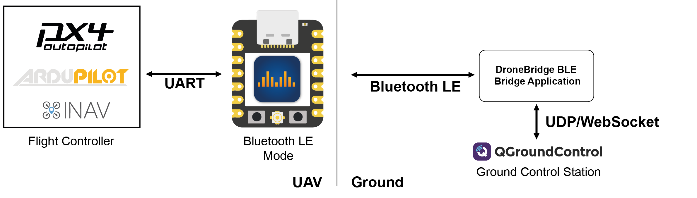
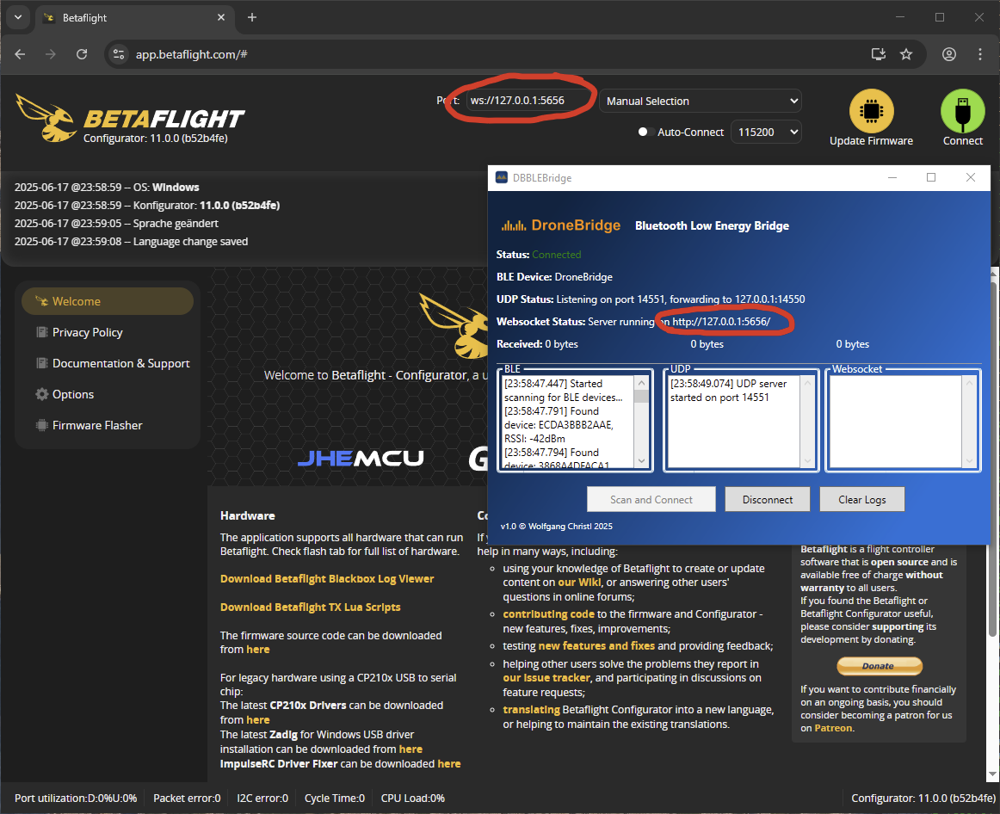

# Bluetooth LE Mode

### Bluetooth LE

<figure><figcaption></figcaption></figure>


At the moment, there is no support by QGC & MissionPlanner for Bluetooth LE (BLE). They only support Bluetooth Classic with the SPP profile, which is not compatible with DroneBridge for ESP32.

Use the supplied "DroneBridge Bluetooth Low Energy Bridge" to connect anyway.


Bluetooth LE (BLE) offers the advantage that it does not block your Wi-Fi connection. You can connect to DroneBridge for ESP32 using BLE and remain connected to your local Wi-Fi (internet).

The BLE link is intended for use with a single ESP32 connected to the flight controller. The range is greatly reduced compared to Wi-Fi, but it is ideal for configuring your UAV without using a cable.

The ESP32 will host a Wi-Fi access point in parallel, so you can use the web interface as usual to configure the ESP32. The SSID and password for the Wi-Fi AP are used from the Wi-Fi AP Mode.

#### DroneBridge Bluetooth Low Energy Bridge

This application is necessary because, as of June 2025, no GCS supports Bluetooth Low Energy (BLE) connections. \
This application translates and bridges a BLE connection to a UDP connection so your GCS can pick up the telemetry stream.

There are two options:

1. **Windows only:** GUI Tool "DroneBridge Bluetooth Low Energy Bridge" - Download below
2. **All Platforms:** Python script (requires `pip install bleak`) no GUI


Download the Windows application. Requires .NET 8 and Windows 10 or newer


<figure><figcaption>
DroneBridge Bluetooth LE Bridge to connect ESP32 in Bluetooth LE Mode to ground control stations.
</figcaption></figure>

Both applications search for the ESP32 in BLE mode, connect to it and create a BLE-UDP bridge.\
Your GCS can connect by listening on UDP 14550. They do this by default, so your GCS should connect automatically.

The Windows GUI application also opens a WebSocket.\
It can be used to connect to Betaflight Configurator or MissionPlanner.

<figure><figcaption>
Betaflight BLE connection using DroneBridge Bluetooth Low Energy Bridge
</figcaption></figure>
