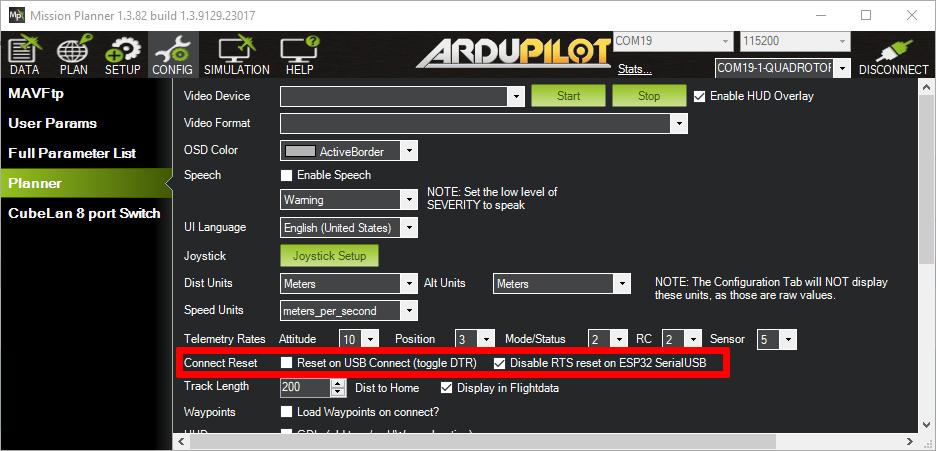

# MissionPlanner Setup

## MissionPlanner Configuration

MissionPlanner supports TCP, UDP and serial connections to the ESP32.\
To use UDP with the ESP32 in Wi-Fi Client mode you must choose UDPCI as a connection protocol. That way you can specify the ESP32's IP and port. The ESP32's IP address is displayed in the web interface.

### USB-Serial Connection

In case your are using ESP-NOW and the USBSerial firmware you must configure MissionPlanner in order to be able to connect to your GND ESP32 using the onboard USB connector.


MissionPlanner fully supports all DroneBridge for ESP32 modes [since it was fixed](https://github.com/ArduPilot/MissionPlanner/pull/3469). The fix will be part of the upcoming releases of MissionPlanner.

[Until then you can download & use the nightly build for that fix here.](https://github.com/ArduPilot/MissionPlanner/actions/runs/12535485063/artifacts/2369275271) For it to work, you must select "Disable RTS reset ..." within MissionPlanner's settings. In case you already tried connecting (without having this setting changed) you need to unplug & replug the GND-ESP32 running USBSerial.


<figure><figcaption>
For the USBSerial firmware flavour to work with MissionPlanner you must set the "Disable RTS reset on ESP32 SerialUSB" checkbox <strong>PIOR</strong> to connecting for the first time. Otherwise you must unplug &#x26; re-plug the ESP32 to your device.
</figcaption></figure>

MissionPlanner can detect the ESP32, if the serial protocol of the ESP32 is configured to MAVLink. That is because all ESP32s will register as a MAVLink device with the GCS.

<figure><figcaption>
MissionPlanner will detect all ESP32s that have the protocol set to MAVLink. Choose your drone from the drop-down in order to use MissionPlanner as always.
</figcaption></figure>

You can also change some of the settings of the ESP32 via MissionPlanner. Select the respective ESP32 from the drop-down and switch to the CONFIG-Tab. There you can change the parameters as usual.&#x20;

Be careful: The settings will be applied immediately and the ESP32 will reboot. This can lead to a permanent connection loss of the telemetry link if the settings are no longer in synch.

<figure><figcaption>
DroneBridge for ESP32 supports the MAVLink parameter protocol. You can change settings directly from the GCS.
</figcaption></figure>
