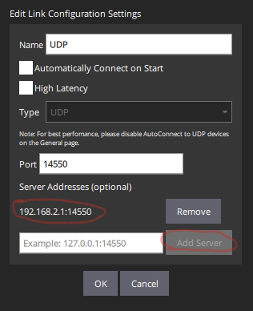

# WiFi Modes

### WiFi Access Point Mode

<figure><figcaption>
DroneBridge for ESP32 Wifi Access Point DroneBridge for ESP32 Wifi Client Mode ConceptMode Concept
</figcaption></figure>

ESP32 will create a Wi-Fi Access Point to which other ground control stations (GCS) can connect. UDP and TCP connections are accepted. All traffic is secured using WPA2-PSK.

#### **Configuration**

A single ESP32 is used and connected via the UART serial interface to the flight controller.

* Set the Mode to `WiFi Access Point Mode` and define an SSID and password for the access point.
* Define the correct pins (for official boards see above) and baud rate for the UART serial interface to the flight controller.
* Set the desired protocol and packet size.

Save the settings and restart the ESP32. After that, you are able to connect to the access point using WiFi. Once connected open the GCS and connect via UDP or TCP to the ESP32s IP address (default is 192.168.2.1 if not defined otherwise in the web interface)

### WiFi Client/Station Mode

ESP32 will try to connect to the specified WiFi Access Point.

You can specify the access point's SSID and password in the web interface using the respective fields. The access point must support at least WEP encryption.

<figure><figcaption>
DroneBridge for ESP32 Wifi Client Mode Concept
</figcaption></figure>

**In case of a UDP connection**, the ground station must send at least one packet (e.g. MAVLink heartbeat etc.) to the UDP port of the ESP32 to register as an endpoint. The ESP32 will then broadcast UDP messages to that packet's origin (port\&ip). Otherwise, the ESP32 will not be aware of the potential clients. The ESP32 on its own will not simply start broadcasting UDP messages.

**For QGroundControl** a server address can be specified when setting up a UDP connection. Add the ESP32s IP and port there:

<figure><figcaption></figcaption></figure>

Alternatively, you can manually add a UDP target via the web interface using the "+" under "connected UDP clients".

**For MissionPlanner** you must choose UDPCI as a connection means. That way you can specify the ESP32's IP and port. The ESP32's IP address is displayed in the web interface.

### WiFi Access Point Mode LR

The access point will be only visible to DroneBridge for ESP32 devices. Offers more range than traditional WiFi access points.

<figure><figcaption>
DroneBridge for ESP32 Concept for ESP32 WiFi Long Range Mode. Requires all parterns to use an ESP32 with LR mode enabled.
</figcaption></figure>

The same as the WiFi Access Point Mode only with espressifs' own LR mode enabled.\
This means that only other DroneBridge for ESP32 devices can see and connect to the access point (the access point is invisible to laptops and phones etc.).&#x20;

Thanks to LR mode the data rate is reduced and the max. possible range greatly increased. [Read more about it here!](https://docs.espressif.com/projects/esp-idf/en/stable/esp32/api-guides/wifi.html#long-range-lr)

An additional serial-to-USB adapter that connects to the configured UART of the GND ESP32 is necessary on the ground. Or use the `USBSerial` or `noUARTConsole` firmware flavour to use the onboard USB connector.\
The GCS then receives the data via that serial device (e.g. COMx on Windows).
