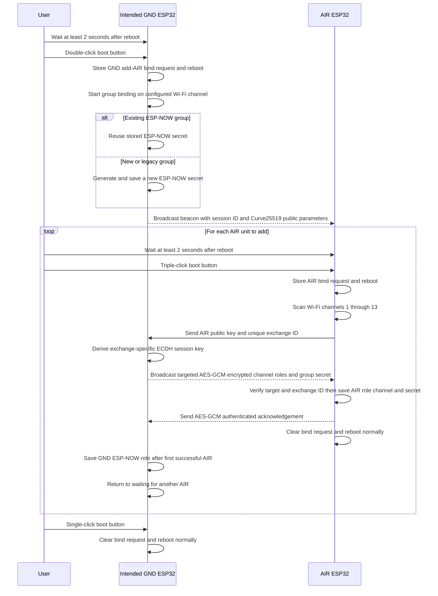

# ESP-NOW Protocol

## Binding Sequence

1. Set the desired final Wi-Fi channel on the unit intended to be the GND.
2. Wait at least two seconds after it boots, then double-click its boot button. It reboots into GND group-binding mode and broadcasts only on its configured channel.
3. If the GND already has an `espnow_secret`, it reuses that secret so previously bound AIR units continue working. If no secret exists, it generates and stores a new 43-character Base64URL secret before accepting an AIR unit.
4. Wait at least two seconds after an AIR unit boots, then triple-click its boot button. The AIR reboots into binding mode and scans Wi-Fi channels 1–13 for up to 90 seconds.
5. The AIR finds the GND beacon, generates an ephemeral Curve25519 key pair and a unique exchange ID, then sends them to the GND.
6. The GND derives an exchange-specific ECDH session key. It sends an AES-GCM encrypted configuration frame targeted to that AIR unit. The configuration contains:
   1. the GND Wi-Fi channel;
   2. ESP-NOW GND mode for the GND;
   3. ESP-NOW AIR mode for the AIR;
   4. the shared ESP-NOW group secret.
7. The AIR verifies that the encrypted frame is intended for its MAC address and exchange ID, saves its configuration, sends an authenticated acknowledgement, and reboots into normal ESP-NOW operation.
8. The GND keeps binding mode active and returns to waiting. Repeat the AIR procedure for every additional AIR unit.
9. Single-click the GND boot button to end the group-binding session. The GND reboots normally. It shows success when at least one AIR was bound, or failure when no AIR was bound.

To replace a group, four-click the GND boot button. This generates a new group secret before binding starts, so every AIR unit must be rebound. Alternatively, select ESP-NOW GND mode in the web interface and use **Rotate secret** next to the link-secret field. Confirming this action immediately invalidates all existing AIR units; start normal GND binding afterwards.

### LED behaviour

On official ESP32-C6 boards:

* Slow pulse: waiting for an AIR unit or scanning for a GND.
* Fast pulse: cryptographic exchange in progress.
* Solid briefly: one AIR was successfully bound, or binding finished successfully.
* Three flashes: binding failed, timed out on AIR, or the GND session ended without binding an AIR.

After every reboot, wait at least two seconds, or wait until the LED shows the next state, before pressing the button again. Other supported targets use the same button flow and serial logging but may not provide LED feedback.

Normal ESP-NOW uses `espnow_secret` when it is set. If empty, it falls back to the legacy shared `wifi_pass`, preserving manually configured pairs.

Binding encrypts the secret against passive listeners. It does not authenticate against an active nearby relay or man-in-the-middle attacker, so bind devices only in a trusted RF environment.
