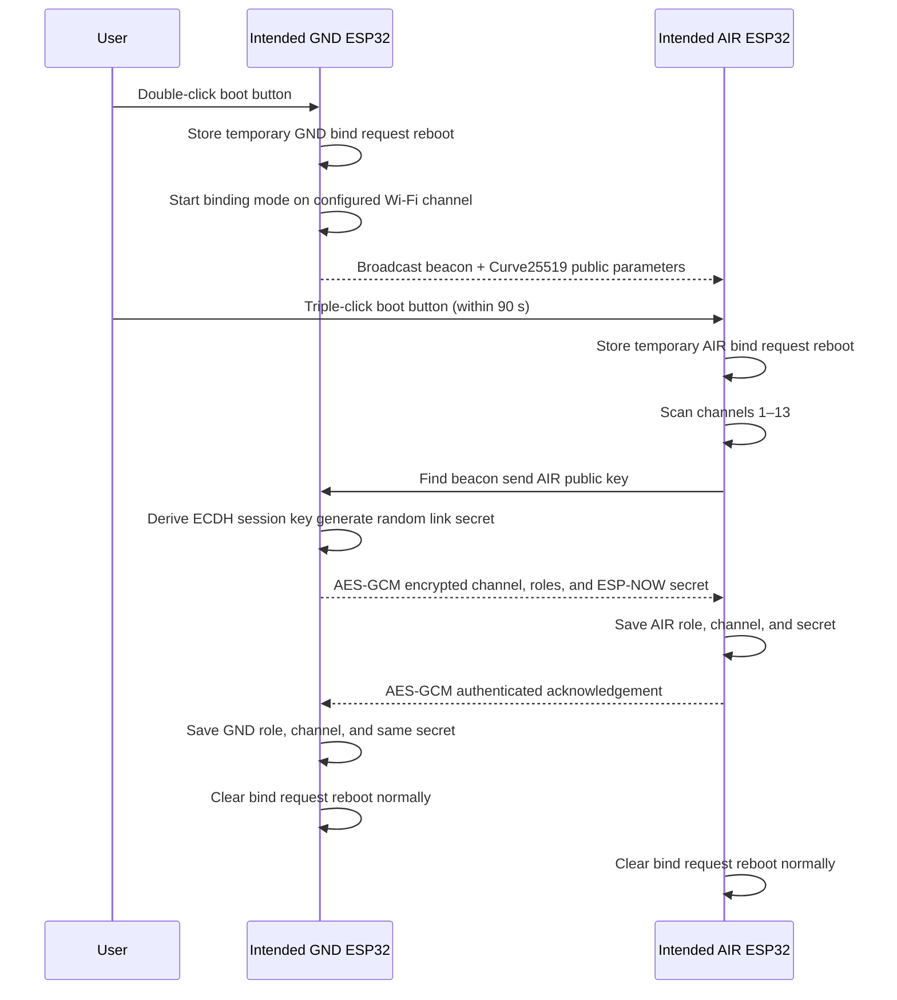

# ESP-NOW Protocol

## Binding Sequence

1. Set the desired final Wi-Fi channel on the unit intended to be GND.
2. Double-click its boot button. It reboots into GND binding mode and broadcasts only on that configured channel.
3. Within 90 seconds, triple-click the intended AIR unit. It reboots into AIR binding mode and scans channels 1–13.
4. AIR finds the GND beacon and the devices exchange ephemeral Curve25519 keys.
5. GND generates a fresh 43-character Base64URL ESP-NOW secret, encrypts it with the derived AES-GCM session key, and sends it with:
   * the GND’s channel;
   * ESP-NOW GND mode for GND;
   * ESP-NOW AIR mode for AIR.
6. AIR saves its configuration and acknowledges it. GND then saves the identical configuration. Both reboot into normal ESP-NOW operation.

On an official C6 board, the LED slowly pulses while searching, rapidly pulses during negotiation, is solid briefly on success, and flashes on failure. Other targets use the same button flow and serial logging.

Normal ESP-NOW uses `espnow_secret` once binding completes. If it is empty, the firmware falls back to the old shared `wifi_pass`, so existing manual pairs continue to work.

The binding session encrypts the new secret against passive listeners. Because this is button-only pairing, bind in a trusted RF environment: it does not authenticate against an active nearby relay/mitm attacker.
