# Hardware & Wiring


**The voltage level of the ESP32 UART is 3.3V!**\
Make sure your flight controller also uses 3.3V UART logic level. You can still power the ESP32 via the 5V line.\
Pixhawk flight controllers do have a 3.3V UART by default and a 5V power supply line. Most ArduPilot flight controllers do as well.\
These flight controllers will not cause any issues.


## Officially Supported Boards

The following boards are officially supported; only these boards will receive support from the main developer. \
These boards are very low in price, have everything you need and are very small. They are perfect for use on any drone. They support all possible modes and setup out of the box and are your fastest way to a working setup.\
**Please consider supporting the project and doing yourself a favour by buying ready-to-use hardware!**

<table data-full-width="false"><thead><tr><th>Official Board Option</th><th>Support for External Antenna</th><th>Ships with External Antenna</th><th>Ideal for</th></tr></thead><tbody><tr><td>Official HW v1.x <strong>ESP32C3</strong> <a href="https://www.ebay.com/itm/116647288610">Order Here</a></td><td>✅</td><td>✅</td><td>range, signal quality</td></tr><tr><td>Official HW v1.x <strong>ESP32C6</strong> <a href="https://www.ebay.com/itm/116868578517">Order Here</a></td><td>✅</td><td>no (onboard antenna)</td><td>compact builds, Wi-Fi autopilot configuration interface</td></tr><tr><td>DIY Hardware Builds <a href="https://buymeacoffee.com/seeul8er/extras">Get files here</a></td><td>✅</td><td>depends on the choice of ESP32 - see the two options above</td><td>people living in places where there is no shipping option available.</td></tr></tbody></table>

### **ESP32 C3 - external antenna**

Germany: [Official board for DroneBridge for ESP32 with external antenna](https://www.ebay.de/itm/116647288610)\
EU/International: [Official board for DroneBridge for ESP32 with external antenna](https://www.ebay.com/itm/116647288610)

### **ESP32 C6 - onboard antenna**

Germany: [Official board for DroneBridge for ESP32 with onboard antenna](https://www.ebay.de/itm/116868578517)\
EU/International: [Official board for DroneBridge for ESP32 with onboard antenna](https://www.ebay.com/itm/116868578517)\
\
The third batch of pre-installed and ready-for-use hardware boards is shipping from Germany to the EU (EEA) and other selected countries (inkl. USA, CAN, JPN). Contact the seller for more non-EU shipping destinations or express shipping. \
For non-EEA shipments, the receiver must handle all customs-related activity (incl. tax, fees etc.). The package will be declared as best as possible.

### Do It Yourself Build

**SMD Version:**\
[**Order the PCB yourself using the KiCAD PCB Project & Production files with private and commercial options!**](https://buymeacoffee.com/seeul8er/e/301194)

<figure>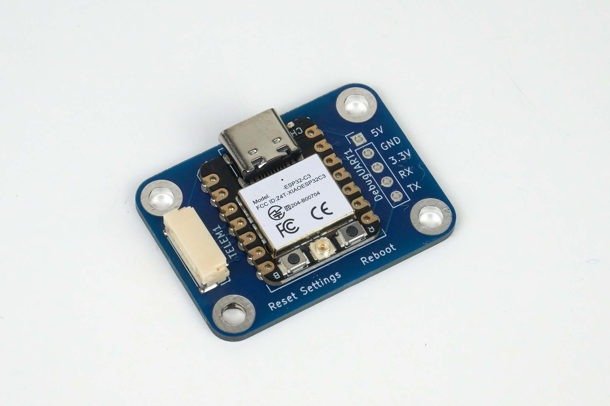<figcaption>
Official Hardware for DroneBridge for ESP32 featuring the <strong>ESP32C3</strong>
</figcaption></figure> <figure>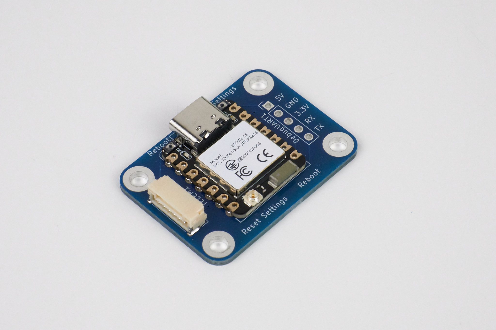<figcaption>
Official Hardware for DroneBridge for ESP32 featuring the <strong>ESP32C6</strong> with an onboard antenna and the connector for an optional external antenna
</figcaption></figure> <figure>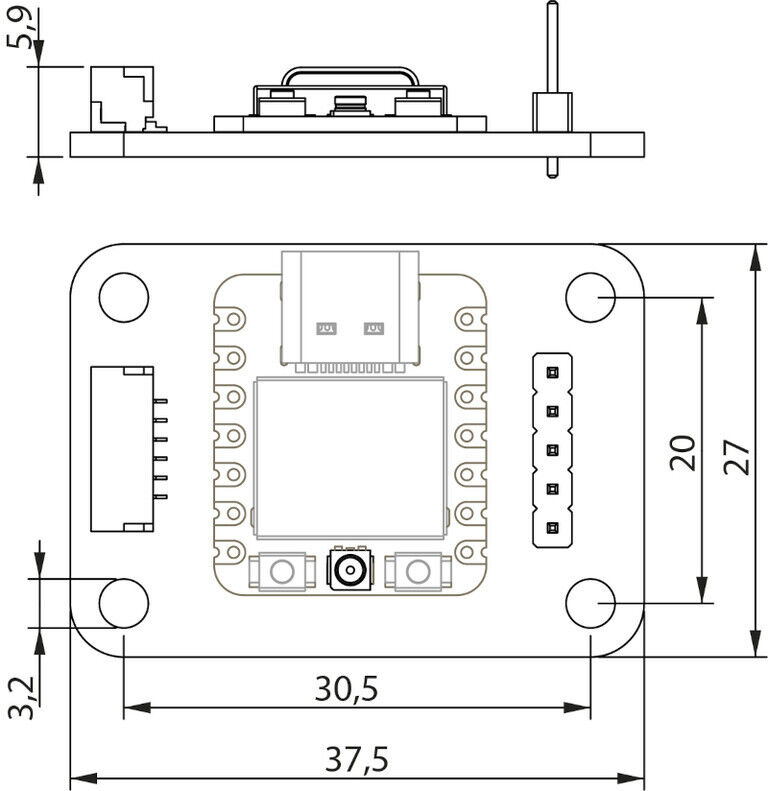<figcaption>
Official board dimensions
</figcaption></figure>

**Easy-Solder DIY Version. No need to deal with SMD parts.** \
[**Order the \[Easy Solder\] PCB yourself using the KiCAD PCB Project and Production files (e.g. via JLCPCB) with private and commercial options!**](https://buymeacoffee.com/seeul8er/e/370820)

This design is overall easier and more affordable to build compared to the SMD version. The downside is that it is a little bigger and does not feature the official Pixhawk standard connector making it less reliable overall. \
The design features big solder pads for connections to the flight controller and simple through-hole mounts for the ESP32 chip. The ideal solution for hobbyists who want a fully supported board and ordering the official ready-made board is no option.

<figure>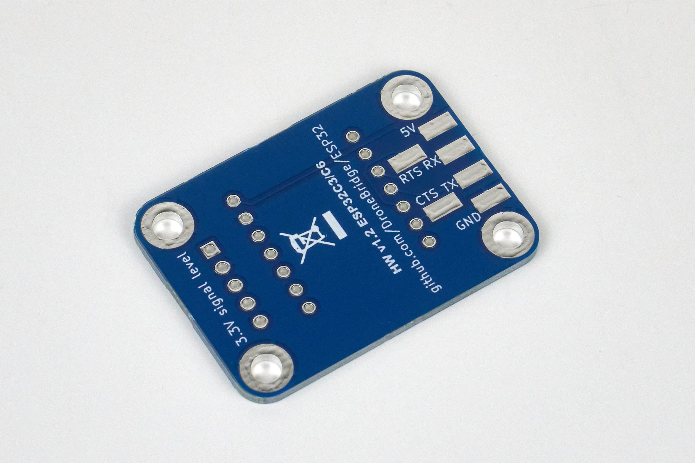<figcaption>
Backside of EasySolder PCB when ordered from PCB manufacturer.
</figcaption></figure> <figure>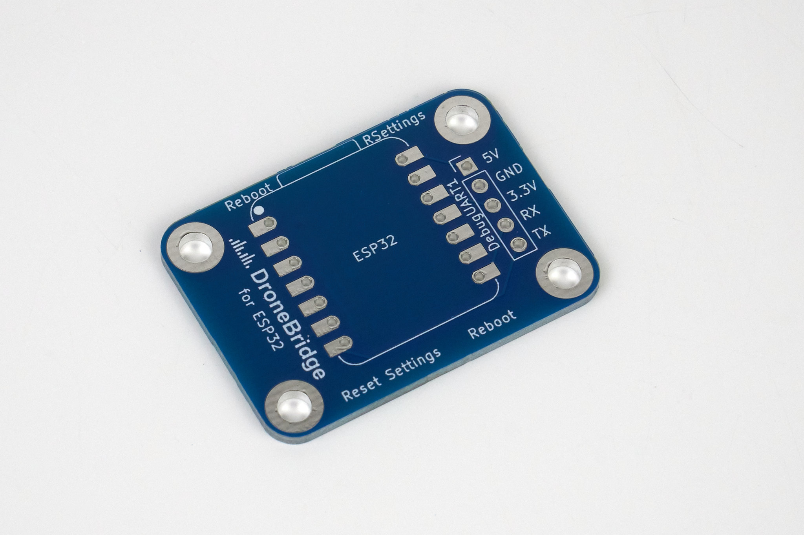<figcaption>
Top of EasySolder PCB when ordered from PCB manufacturer.
</figcaption></figure> <figure>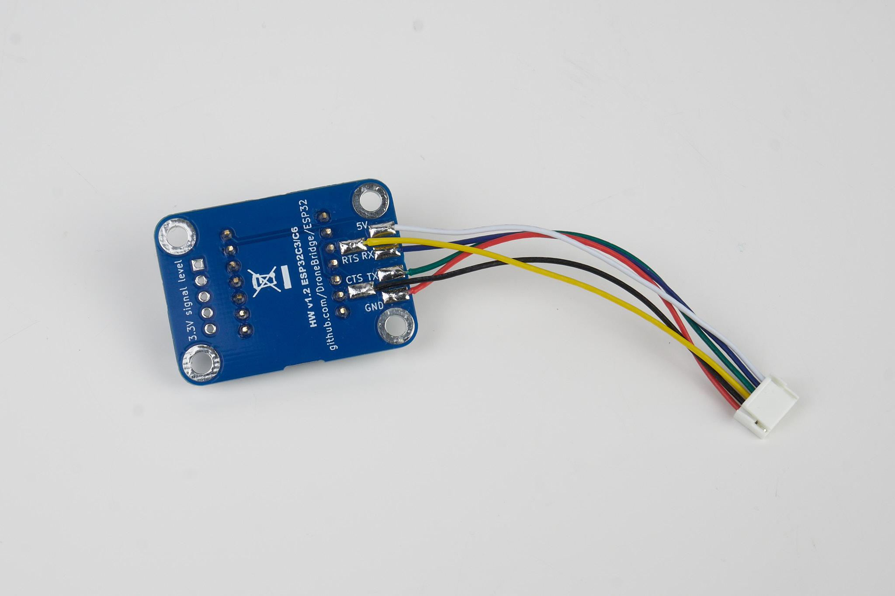<figcaption>
EasySolder PCB wired up with optional RTS/CTS connections for UART flow control.
</figcaption></figure> <figure>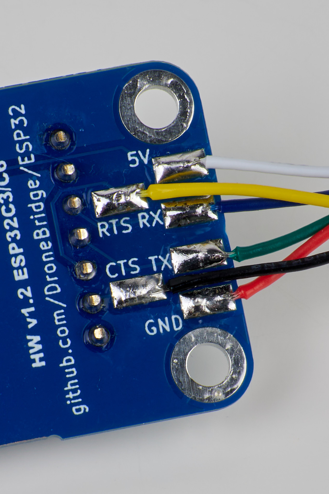<figcaption>
EasySolder PCB wired up with optional RTS/CTS connections for UART flow control.
</figcaption></figure> <figure>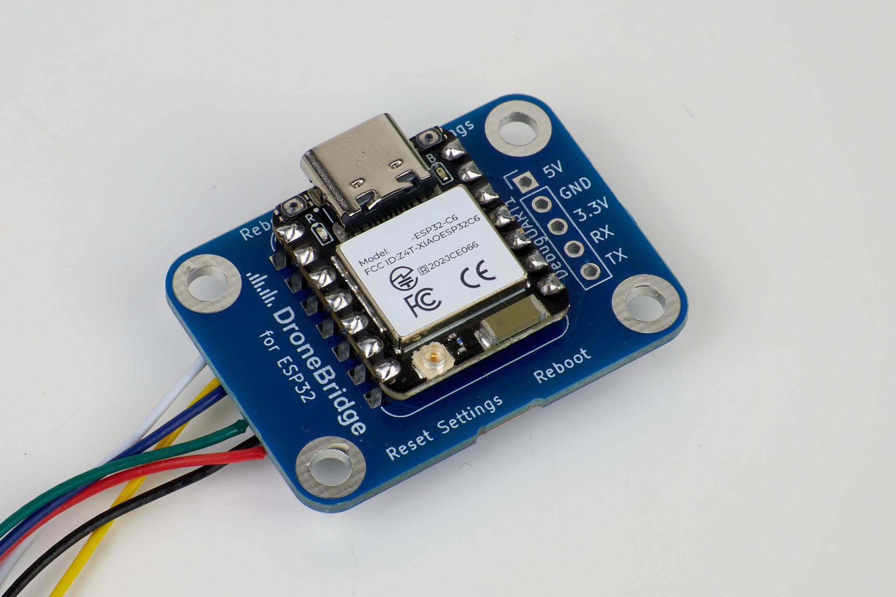<figcaption>
EasySolder version with an ESP32C6 attached using simple through holes.
</figcaption></figure>

## Other Boards


These boards might also work but are not tested and will not receive support from the main project.


Other boards that will likely work:

* [ESP32-C3-DevKitM-1](https://docs.espressif.com/projects/esp-dev-kits/en/latest/esp32c3/esp32-c3-devkitm-1/index.html)
* [ESP32-S3-DevKitC-1](https://docs.espressif.com/projects/esp-dev-kits/en/latest/esp32s3/esp32-s3-devkitc-1/index.html)
* [NodeMCU ESP32S](https://www.waveshare.com/nodemcu-32s.htm)
* Seeed Studio XIAO ESP32C3
* Seeed Studio XIAO ESP32C6

Other ESP boards are very likely to work as well. You don't need any additional PSRAM, just make sure they come with flash memory installed (internal or external - very few boards come with no flash installed, so this is no issue most of the time). \
If your ESP32 board does not come with a USB-to-Serial adapter or the USB is not connected to the internal JTAG-USB Interface (the case with some ESP32 C3 & ESP32 C6 boards), you will need one to flash the firmware. \
When wiring the power supply lines, follow the instructions of the board manufacturer. Some modules do not like an external 5V power input connected in addition to a USB at the same time.

The following ESP32 chips are supported:

* ESP32 - _not recommended for new builds._ `noUARTConsole` _firmware not available_
* ESP32S2
* ESP32S3
* ESP32C3
* ESP32C6

Almost any board featuring one of these chips should work. See the wiring and flashing instructions on how to use the unofficially supported options

## Wiring

### Wiring to the Flight Controller


GND, 5V, TX & RX connections are mandatory! \
RTS & CTS connections are optional. Do not configure RTS & CTS pins in the web interface if you did not connect them to the flight controller. In that case, leave them both to set to 0 to disable UART flow control.


#### Official DroneBridge for ESP32C3/C6 Board

Easy! Just connect the board to your flight controller using the provided cable.\
In case you are not using the standard Pixhawk telemetry connector see the reference for the output here:

<figure><figcaption>
Pinout of the Official DroneBridge for ESP32 Hardware board featuring the ESP32C3
</figcaption></figure>

#### Seeed Studio XIAO ESP32C3 & ESP32C6

You can connect your flight controller using any available pins **except for the TX & RX labelled pins and the ones marked in the picture below**. \
It is highly recommended to use GPIO4, GPIO5, GPIO6 & GPIO7 for the ESP32-C3 and GPIO2, GPIO21, GPIO22 & GPIO23 for the ESP32-C6.\
The image below shows an **example of connecting** to the PX4 standard telemetry port.

<figure>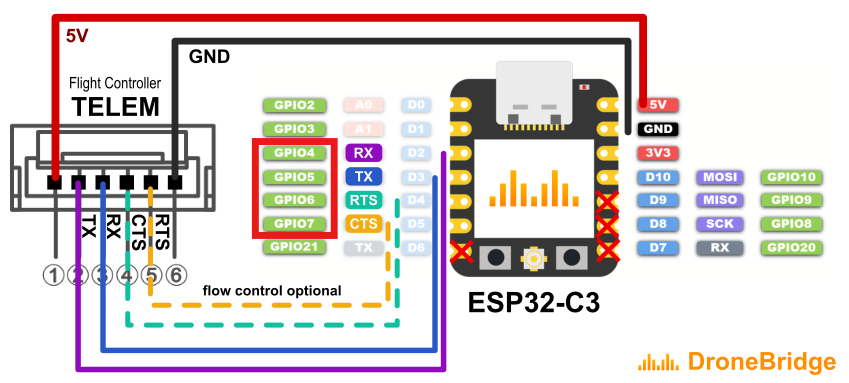<figcaption>
XIAO ESP32C3 to Pixhawk standard connector wiring
</figcaption></figure>

<figure>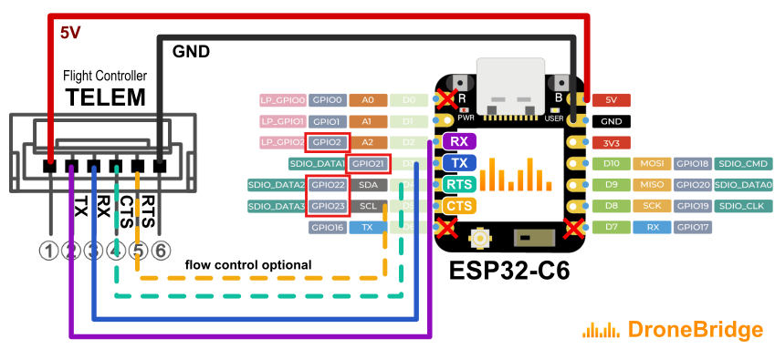<figcaption>
XIAO ESP32C6 to Pixhawk standard connector wiring
</figcaption></figure>

* Connect the Pixhawk telemetry TX pin to a free ESP32 GPIO (see exceptions above) - **note the GPIO number**, not the D#! This pin will be configured as TX in the web interface.
* Connect the Pixhawk telemetry RX pin to a free ESP32 GPIO (see exceptions above) - **note the GPIO number**, not the D#! This pin will be configured as RX in the web interface.
* Connect the Pixhawk telemetry GND pin to the ESP32 GND pin
* Connect the Pixhawk telemetry 5V pin to the ESP32 5V pin
* Optional: Connect the Pixhawk telemetry CTS pin to a free ESP32 pin (see exceptions above). This pin will be configured as RTS in the web interface.
* Optional: Connect the Pixhawk telemetry RTS pin to a free ESP32 pin (see exceptions above). This pin will be configured as CTS in the web interface.

#### Generic ESP32 Boards

You can use any of the available pins to connect your flight controller to the ESP32\`s UART **except for the TX & RX labelled pins of your dev. board**.\
The reason for that is that most boards are using the TX & RX labelled pins for the default flashing/debugging UART of the ESP32. These pins will output debugging information and allow to install the firmware. The DroneBridge for ESP32 firmware is not configured to re-assign that UART. Your device will crash if you choose them anyway.

**Do not use so-called "strapping pins", these pins are connected to the boot button and using them for I/O may result in unexpected crashes.** For the ESP32-C3 the strapping pins are GPIO2, GPIO8 and GPIO9. For many other ESP32 chips, GPIO0 is a strapping pin. Check the datasheet of your ESP32 chip to get the strapping pins.

Pins that do not work:

<table><thead><tr><th width="114">Chip</th><th width="587">Pins that do not work with DroneBridge</th></tr></thead><tbody><tr><td>ESP32</td><td>GPIO0, GPIO2, GPIO5, GPIO12 (MTDI), and GPIO15 (MTDO) GPIO6-11 and GPIO16-17 are usually connected to the SPI flash</td></tr><tr><td>ESP32-C3</td><td>GPIO2, GPIO8 and GPIO9 GPIO12 ~ GPIO17 are usually used for SPI flash</td></tr><tr><td>ESP32-C5</td><td>GPIO2, GPIO7, GPIO25, GPIO27, and GPIO28 GPIO16 ~ GPIO22 are usually used for SPI flash</td></tr><tr><td>ESP32-C6</td><td>GPIO4, GPIO5, GPIO8, GPIO9, and GPIO15 GPIO24 ~ GPIO30 are usually used for SPI flash</td></tr></tbody></table>

**Beware of the GPIO numbers, board manufacturers often re-number their pins and the numbers do not match with the GPIO numbers!**

### Wiring for usage with a Ground Control Station (GCS)

The ESP-NOW mode & the WiFi LR Mode require an ESP32 as a receiver on the ground (the other modes follow the plain wifi standard so you can use any WiFi adapter to connect). \
To use the ESP32 on the GND as a receiver you have the following wiring options:

Official Hardware Boards can use an external USB-to-Serial adapter or the onboard USB-C connector. To use the official board's onboard USB-C connector, you must flash the firmware flavour "USBSerial" to the GND-ESP32.

<figure><figcaption>
Wiring concept for the official DroneBridge for ESP32 hardware
</figcaption></figure>

Non-official Hardware must use an external USB-to-Serial adapter connected to the ESP32s pins or they flash the noUARTConsole firmware to use the onboard USB-to-Serial chip:

<figure>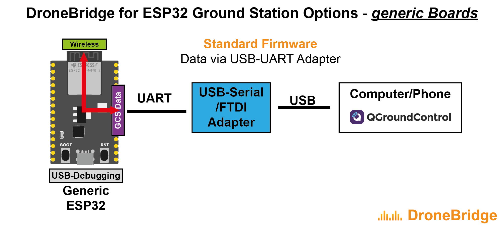<figcaption>
Wiring concept for generic ESP32 hardware
</figcaption></figure>

#### Using the onboard USB-C connector (USB-JTAG interface)


This works only with officially supported boards and boards with a USB connector connected to the ESP32's USB-JTAG interface.

The ESP32 (classic) does not support this mode.


Flash the special flavour of DroneBridge for ESP32 with the suffix `USBSerial`. This will output all data received via the radio link to the USB port (USB-JTAG interface). Not all ESP32 modules and boards are compatible. Boards with two USB ports will work as well as the XIAO ESP32 board series.\
There is no need for a Serial-to-USB/FTDI adapter in this case!

**Ground Control Station Support:**

**MissionPlanner** fully supports USBSerial mode [since it was fixed](https://github.com/ArduPilot/MissionPlanner/pull/3469). The fix will be part of the upcoming releases of MissionPlanner. [Until then you can download & use the nightly build for that fix here.](https://github.com/ArduPilot/MissionPlanner/actions/runs/12535485063/artifacts/2369275271) For it to work you must select "Disable RTS reset ..." within MissionPlanner's settings. In case you already tried connecting (without having this setting changed) you need to unplug & replug the GND-ESP32 running USBSerial.

<figure><figcaption></figcaption></figure>

**QGroundControl** partially supports the USBSerial firmware flavour. Once QGroundControl disconnected or was closed you have to press the reset button of the GND ESP32 to reboot it. Otherwise, no new connection can be established to QGC.\
The reason for that is that the DTS & RTS lane of the USB is set to low when the disconnect happens. This will set the ESP32 into download mode preventing a proper restart of the firmware. This could be fixed by the GCS however, it is not fixed yet.

#### Using an external Serial to USB adapter

Connect the USB-to-Serial adapter to the ESP32\`s GPIOs and configure the GPIO pins via the web interface. Now connect the ESP32 via the USB-to-Serial adapter to the computer and open the GCS. Within the GCS connect to the USB-to-Serial adapter to receive the telemetry stream. This mode is supported by MissionPlanner & QGC. If you wire the RTS & CTS pins (not recommended for GND ESP32) of the Serial-to-USB adapter as well you might need to run into issues as described in the section for "onboard USB connectors".

For reference see:

<figure><figcaption>
DroneBridge for ESP32 with an external FTDI/USB-to-Serial adapter wired to the TELEM1 port for useage as a receiver on the Ground Control Station (GCS).  An external RP-SAM antenna gives more freedom regarding reception. Case is 3D printed using FFF.
</figcaption></figure>

### UART Flow Control

To enable flow control you must wire two additional lines RTS and CTS. They cross over just like TX & RX. Any pin of the ESP32 (except for the TX & RX marked pins) can be used for RTS and CTS. Just choose one and make sure your board manufacturer did not connect it to the internal flash or USB port.\
**For the XIAO ESP32C3 board, this means: Do not choose D6 or D7.**
