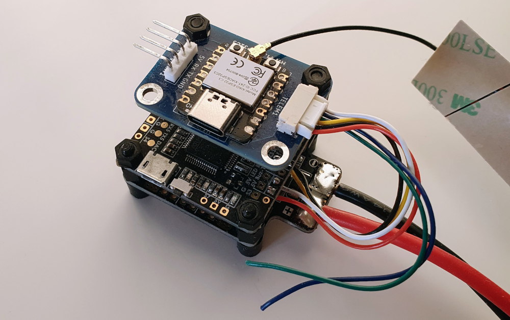
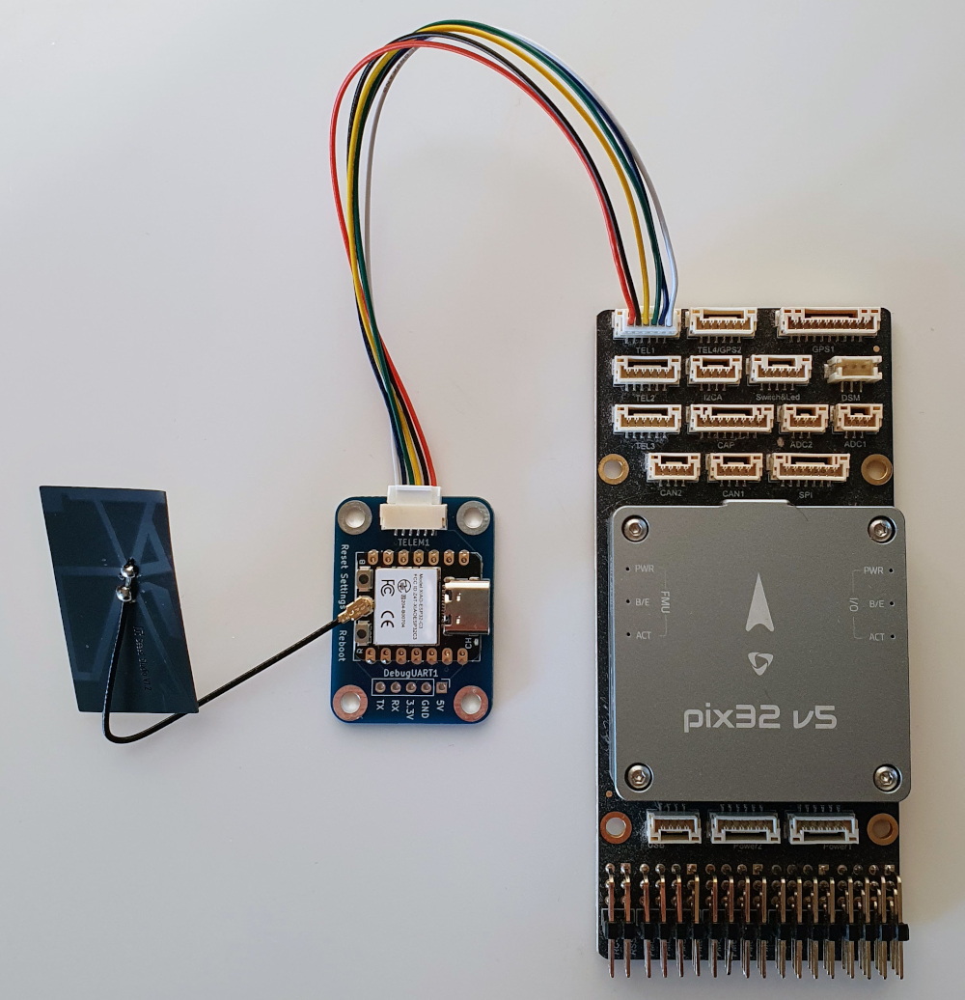
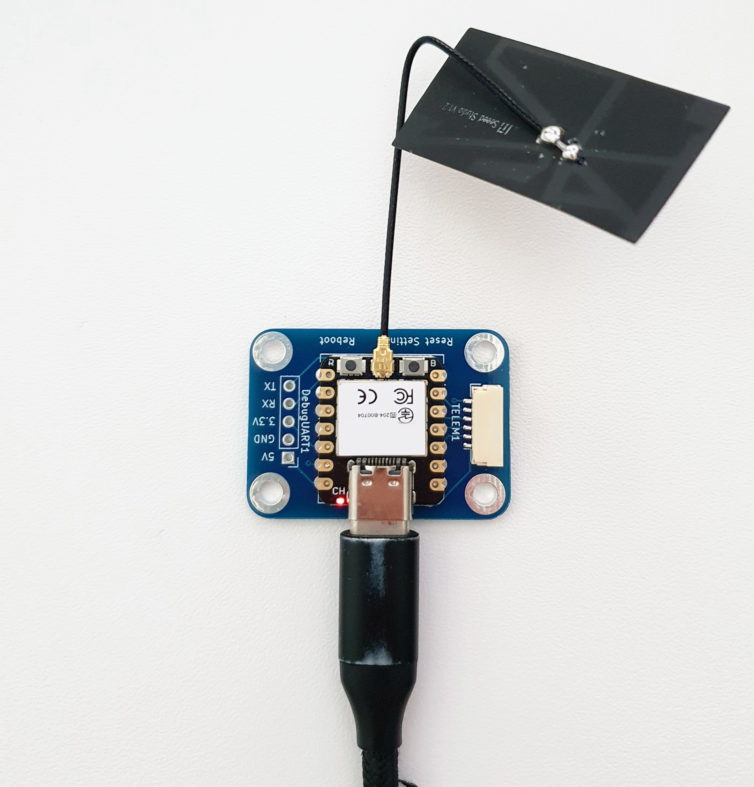
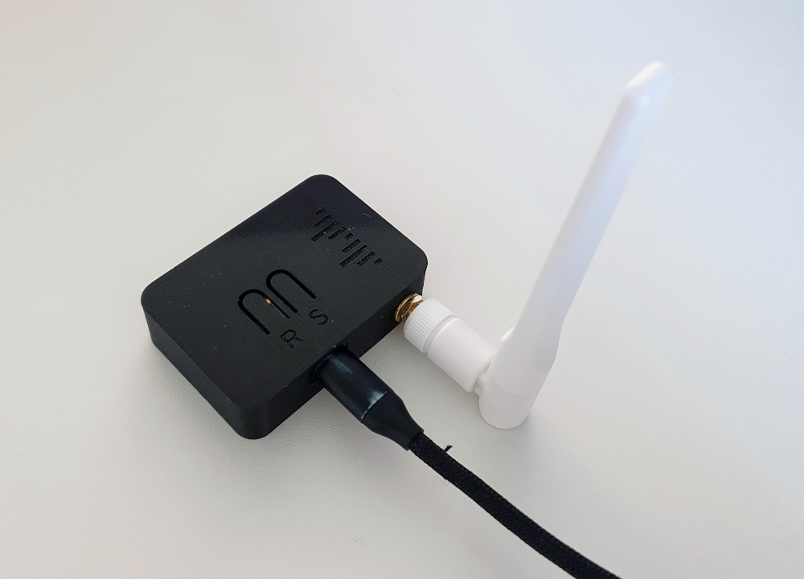
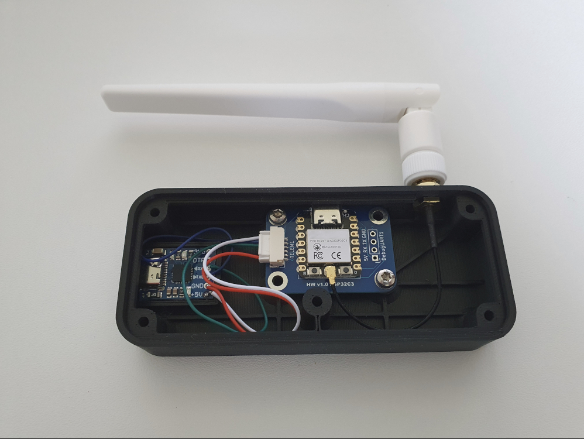
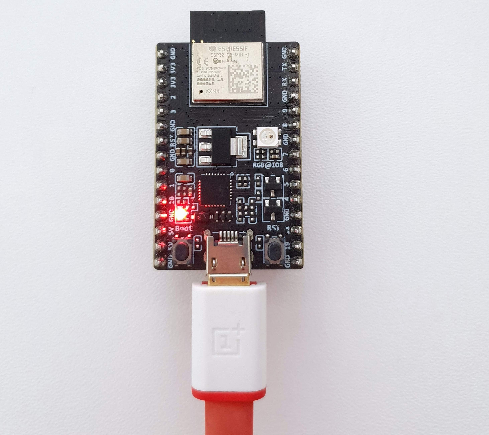

# Hardware Setup Examples

The AIR-Unit is the ESP32 that connects to the flight controller, while the GND-Unit is connected to a  GCS-PC or phone. The GND-Unit is only required in setups using WiFi-LR or ESP-NOW modes.

## AIR-Unit Examples

All AIR-Units run the standard DroneBridge for ESP32 firmware.

<figure><figcaption>
Matek F405STD flight stack with official DroneBridge for ESP32 HWv1.0 Board connected to flight controllers UART. The flow control lines are left unconnected.
</figcaption></figure> <figure><figcaption>
pix32 v4 (PX4) flight controller with official DroneBridge for ESP32 HWv1.1 Board connected to TELEM1 port for MAVLink telemetry.
</figcaption></figure>

## GND-Unit Examples

These setups are only required when using ESP-NOW or WiFi-LR Modes. Different firmware flavours are available. They differentiate themselves by which interface they pass the data to the PC-GCS.

### Interface via USB-JTAG Interface

This setup requires you to flash the `USBSerial` firmware flavour to your GND-ESP32. \
Only a few ready-made boards like the official HW boards featuring the C3 & C6 ESP32 chips support this mode.

<figure><figcaption>
Official DroneBridge for ESP32 HWv1.1 board in GND-Station mode running the USBSerial firmware flavour. All telemetry is outputted via the onboard USB connector that is connected to the ESP32's USB-JTAG interface.
</figcaption></figure> <figure><figcaption>
Official DroneBridge for ESP32 HWv1.1 board in GND-Station mode using an external antenna and the official case. It is running the USBSerial firmware flavour. All telemetry is outputted via the onboard USB connector that is connected to the ESP32's USB-JTAG interface.
</figcaption></figure>

### Interface via External Serial-to-USB Adapter

This setup requires you to flash the regular firmware.

<figure><figcaption>
GND receiver unit for ESP-NOW Mode: Official DroneBridge HWv1.0 board with external antenna and the CJMCU CP2102 USB-to-Serial adapter to interface to a PC or Smartphone. Only 5V, GND, TX &#x26; RX are connected.
</figcaption></figure>

This method always works and can be used with all boards. A recommended Serial-to-USB adapter is for example the CJMCU CP2102 with USB-C. It supports 5V power output and 3.3V UART signal level at the same time, making it 100% compatible with the Pixhawk standard.\
Connect the adapter using any available pins (see [Hardware & Wiring instructions](hardware-and-wiring.md) for exceptions). \
In general, it is not recommended to enable flow-control (only wire GND, VDD, TX & RX) since it may lead to unexpected issues and is usually not needed on the GND side.

This setup is robust and works with MissionPlanner & QGroundControl out of the box.

### Interface via Onboard Serial-to-USB Chip

This setup requires you to flash the `noUARTConsole` firmware.

Note: The `noUARTConsole` firmware is not available for the ESP32 (Classic)!

<figure><figcaption>
ESP32-C3-DevKitM-1 in GND-Station mode running the noUARTConsole firmware flavour. All telemetry is outputted via the onboard USB connector that is connected to the onboards USB-to-Serial chip that in turn is connected to the ESP32's UART interface. 
</figcaption></figure>

Most generic ESP32 development boards come with an onboard Serial-to-USB chip as part of the board. Usually, that onboard Serial-to-USB chip is connected to the debugging UART of your ESP32 (TX & RX marked pins on your development board). It is used for conveniently flashing and debugging the firmware, removing the need for an external Serial-to-USB adapter. That is why you cannot use/configure these pins with DroneBridge. They are already occupied.

The special firmware flavour `noUARTConsole`  disables the debugging console on that UART, freeing it for use with DroneBridge. This means you can connect your PC directly to the USB port of the development board's onboard Serial-to-USB chip. All data will be transmitted using that UART.\
You must configure the UART\`s GPIO pins in the web interface. Check the manufacturer's data sheet for the correct GPIO numbers. They are usually marked with TX & RX on the board.
