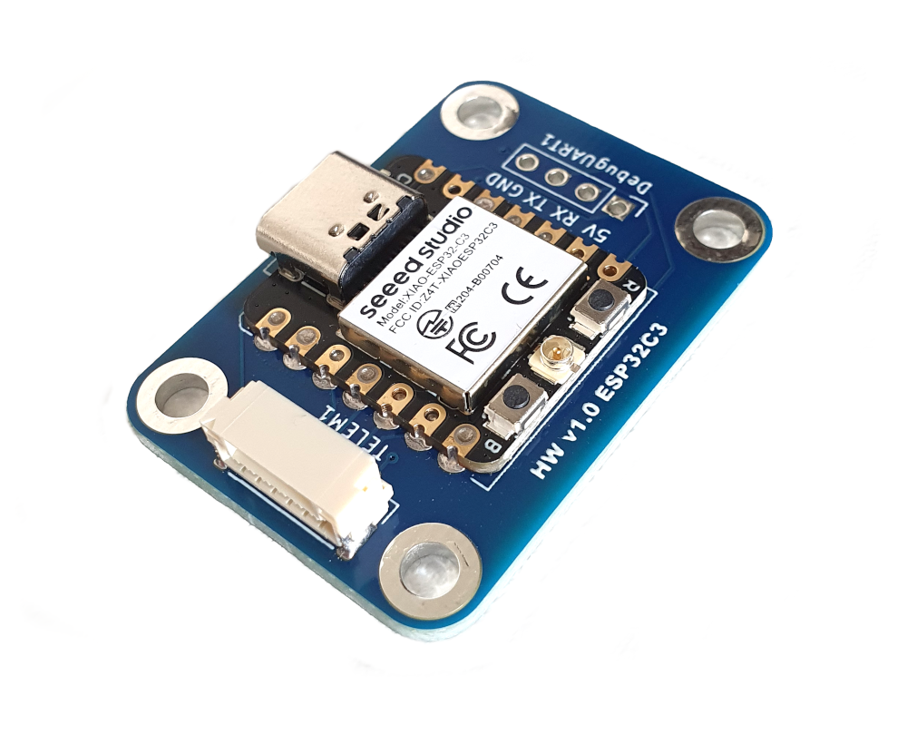
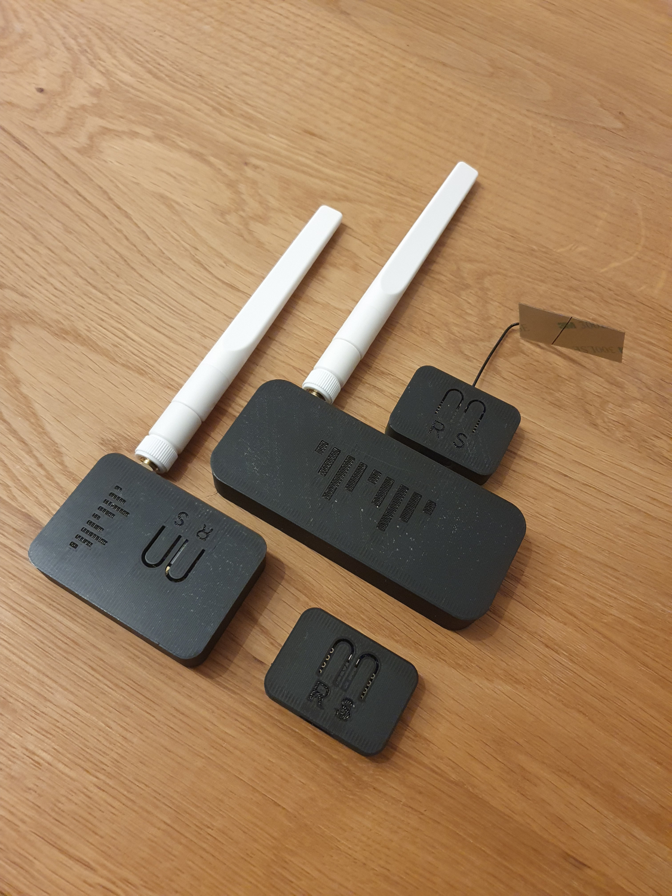
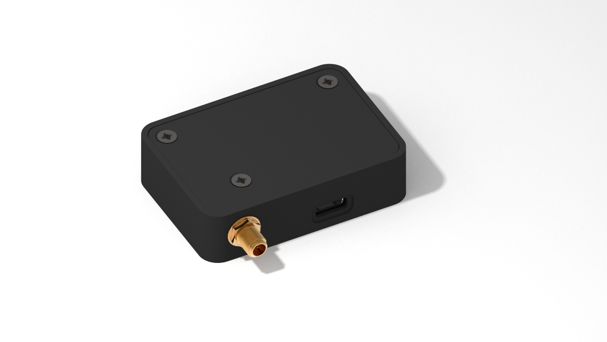
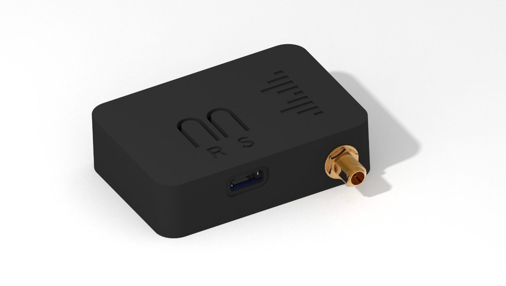

# Overview


## Looking for the Drone Light Show Edition?

[Check the dedicated Wiki section on the Drone Light Show Edition!](../dronebridge-for-esp32-drone-light-show-edition/overview-drone-light-show-edition.md)


## DroneBridge for ESP32

DroneBridge enabled firmware for the popular ESP32 modules from Espressif Systems. It's probably the cheapest way to communicate with your drone, UAV, UAS, ground-based vehicle or whatever you might call them.

It also allows for a fully transparent serial to wifi pass-through with variable packet size.


DroneBridge for ESP32 differs from the DroneBridge for Raspberry Pi Project.\
DroneBridge for ESP32 is easier to use and set up, more robust and polished. The output power is limited to 20 dBm by the hardware. This means it is legal to use in most countries since it follows the Wi-Fi standard.\
\
However, it currently does not support video or radio control! \
The range is also limited to \~1km using ESP-NOW.


## Official Project Page


**Visit the official Project Page for more up-to-date information!**

[https://drone-bridge.com](https://drone-bridge.com)


## Features

* Bidirectional:&#x20;
  * serial-to-WiFi
  * serial-to-ESP-NOW link
  * serial-to-BLE (Bluetooth Low Energy) in release v2.2+
* Support for **MAVLink**, **MSP**, **LTM** or **any other payload** using the transparent option
* Affordable
* Up to **150m+ range** using standard WiFi
* Up to **1km of range** using ESP-NOW or Wi-Fi LR Mode - sender & receiver must be ESP32 with LR-Mode enabled
* **Fully encrypted** in all modes, including ESP-NOW broadcasts secured using AES-GCM 256-bit!
* Weight: <8 g
* Supported by: QGroundControl, Mission Planner, mwptools, impload etc.
* Easy to set up: Power connection + UART connection to flight controller
* Fully configurable through an easy-to-use web interface
* Parsing of LTM & MSPv2 for a more reliable connection and less packet loss
* Parsing of MAVLink with the injection of Radio Status packets for the display of RSSI in the GCS
* Fully transparent telemetry downlink option for continuous streams
* Reliable, low-latency

<figure><figcaption>
Official DroneBridge for ESP32 board featuring an ESP32C3
</figcaption></figure>

Blackbox concept. UDP & TCP connections are possible. Automatic UDP unicast of messages to port 14550 to all connected devices/stations. Allows additional clients to register for UDP. The client must send a packet with a length > 0 to the UDP port of ESP32.

<figure><figcaption>
DroneBridge for ESP32 Web-Interface as of v2.0RC3
</figcaption></figure>

## Official DroneBridge for ESP32 Groundstation Hardware

Here are some real-life examples using the official board with a 3D-printed case. The cases are only available for the ESP32-C3 variant of the official board.

<figure><figcaption>
Different options for DroneBridge for ESP32 ground stations using external antennas and the official hardware.
</figcaption></figure>

<figure><figcaption>
Small version of the ground station using an external RP-SMA antenna.
</figcaption></figure> <figure><figcaption>
Case with the Reset and Settings Reset button
</figcaption></figure>

